# 🎬 Netflix GPT

A responsive, cinematic movie discovery app powered by GPT and TMDB. Built with React, Firebase, Redux, and Tailwind CSS. Ask for movie suggestions like “movies like 3 Idiots” and get instant recommendations with trailers, titles, and descriptions—just like Netflix, but smarter.

🔗 [Live Demo](https://netflixgpt-21b53.web.app/)  
📁 [GitHub Repo](https://github.com/Aneesh-Khanna/netflix-gpt)

---

## 🚀 Features

- 🔐 Firebase Authentication (Sign In / Sign Up)
- 🧠 GPT-powered movie suggestions
- 🎞️ TMDB API integration for trailers, posters, and metadata
- 🌐 Multi-language support
- 🌙 Dark/Light theme toggle
- 📱 Fully responsive layout (mobile, tablet, desktop)
- 🔄 Seamless navigation with session-aware back buttons
- ⚡ Shimmer UI for loading states (Browse + Watch pages)
- 🔔 Toast notifications for GPT search
- 📄 Offline page with custom hook
- 🧼 Memoization to prevent redundant API calls
- 🧭 Watch page with dynamic routing and video playback
- ❌ No results UI for GPT search
- 🧙 Intelligent filtering for exact movie matches
- 🔐 Environment variables via `.env` (keys hidden in production)

---

## 📸 Screenshots

### 🔐 Login / Signup Page
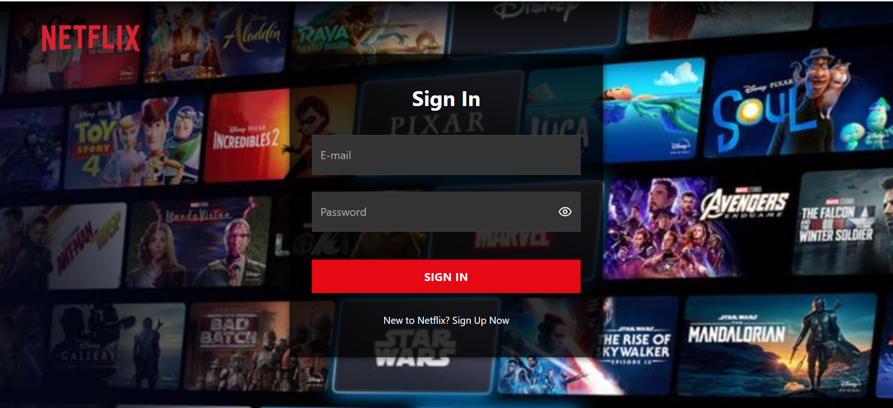
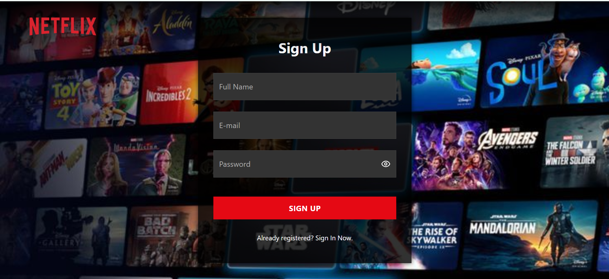

### 🎞️ Browse Page
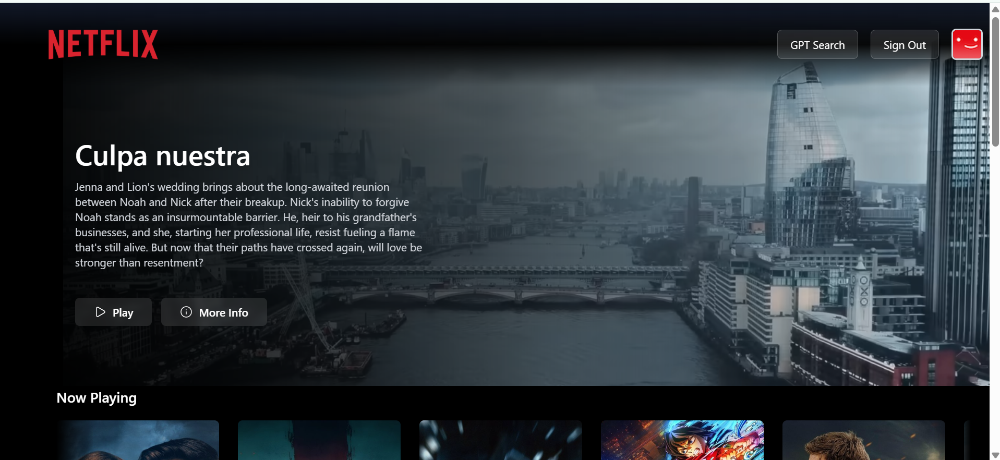
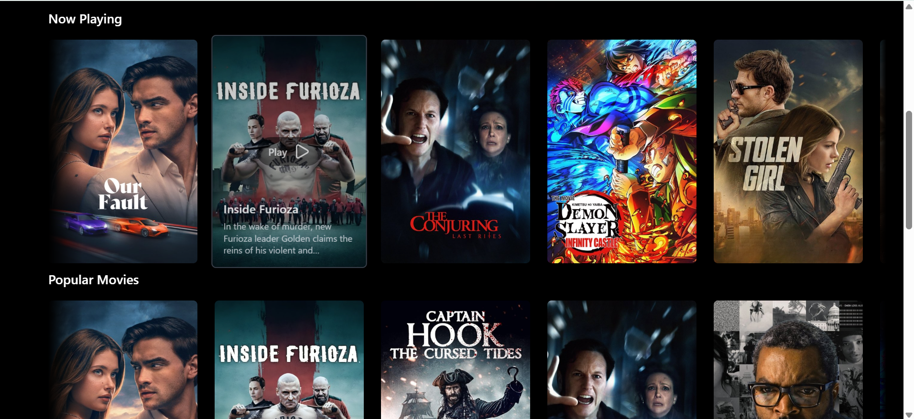
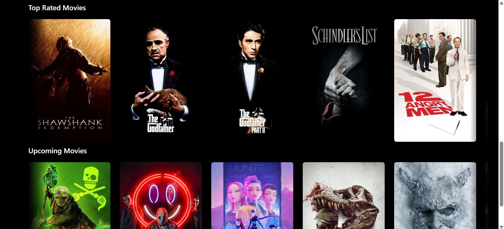
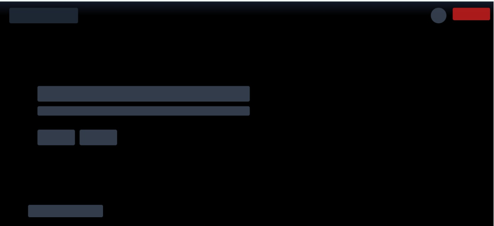


### 🔍 GPT Search (Dark Theme)
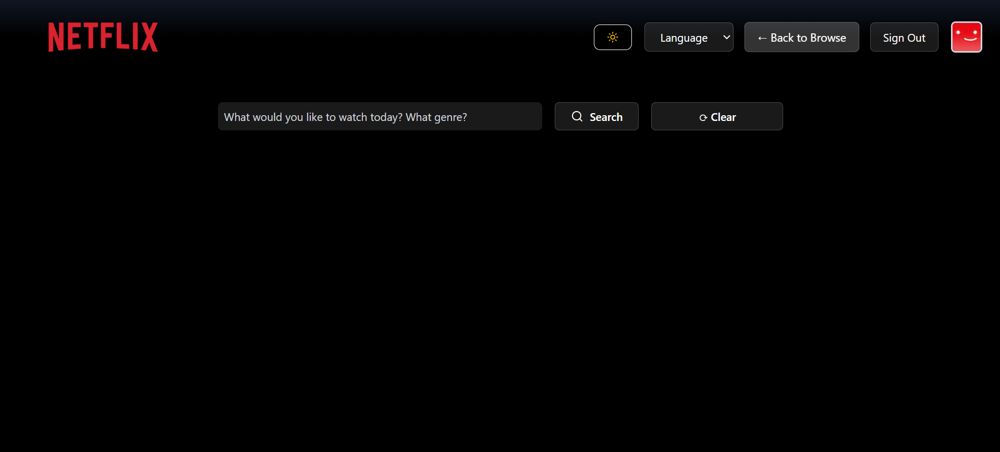
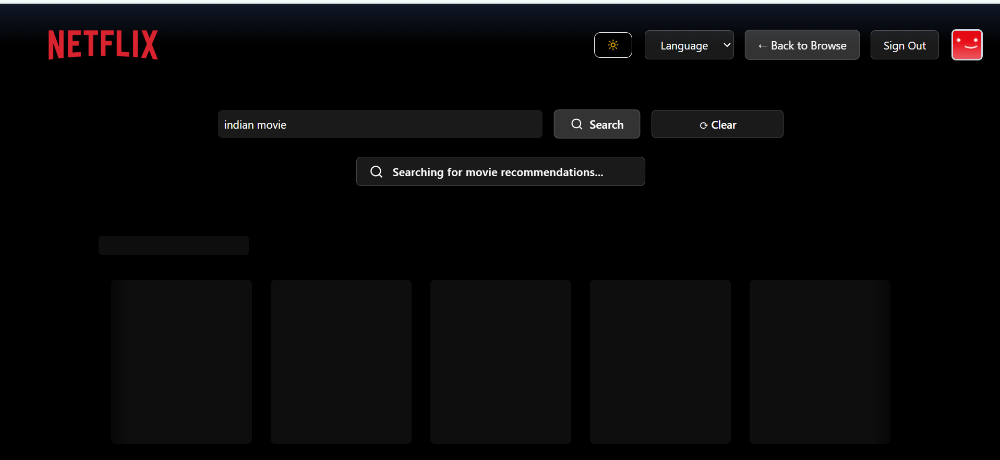
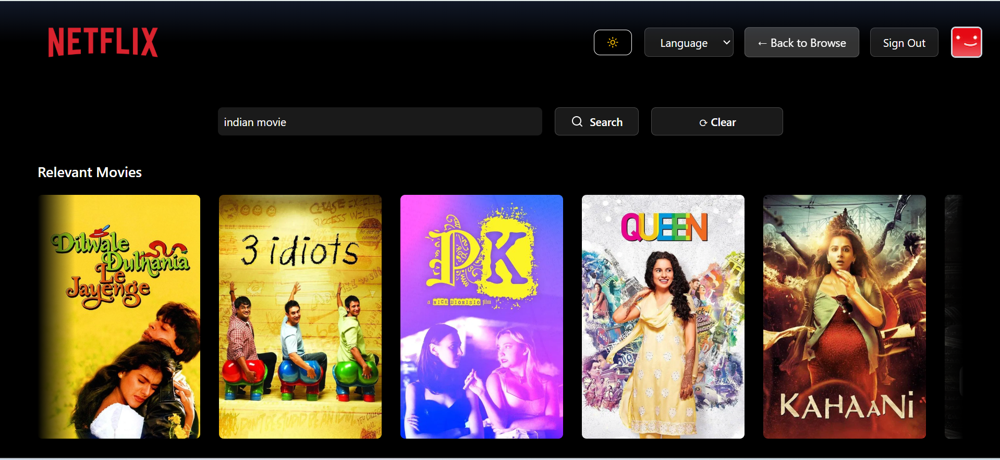
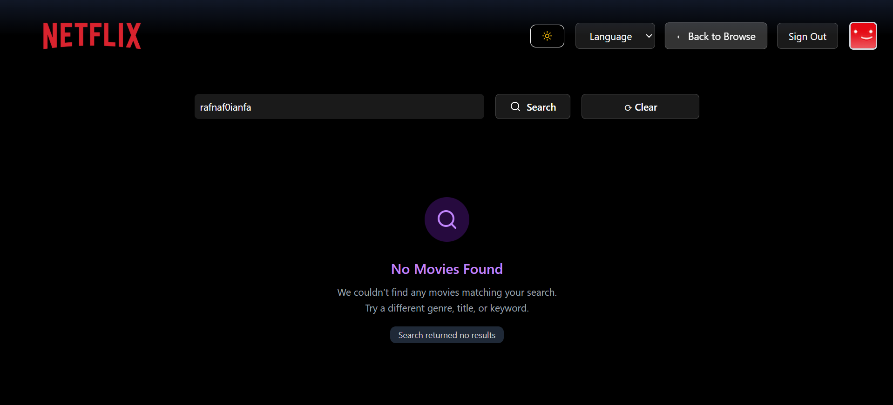

### 🔍 GPT Search (Light Theme)
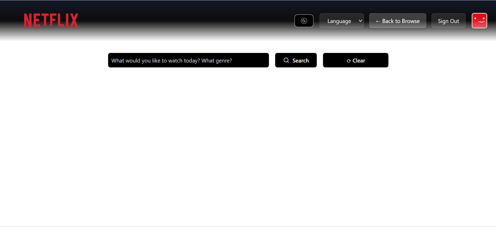
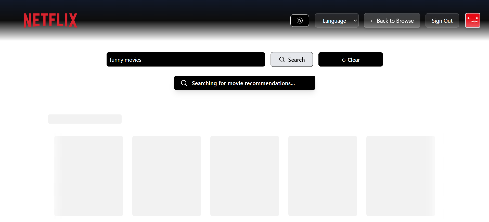
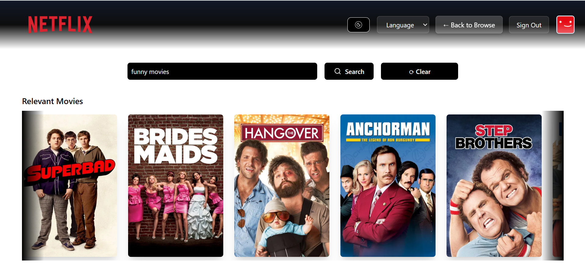
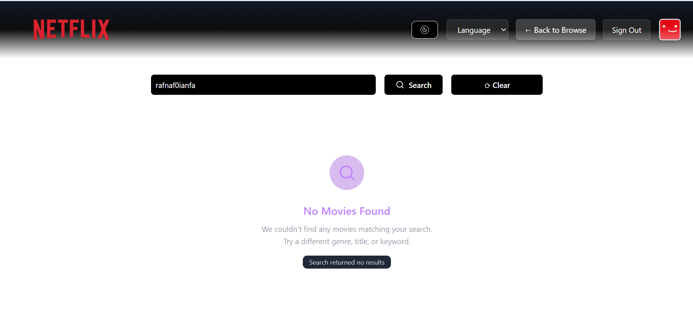


### 📺 Watch Page
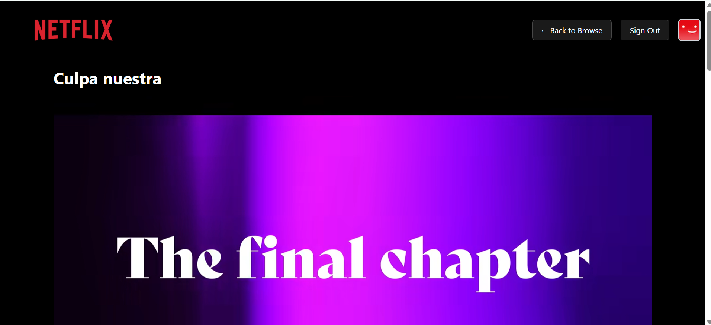
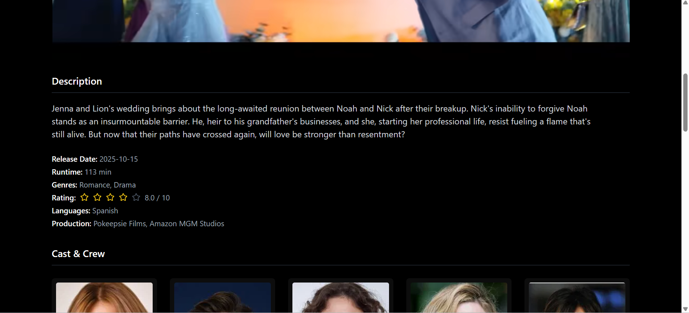


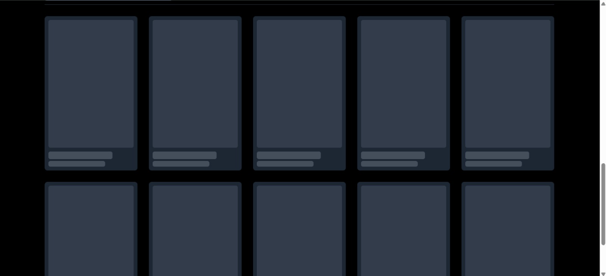

### 📄 Offline + Redux

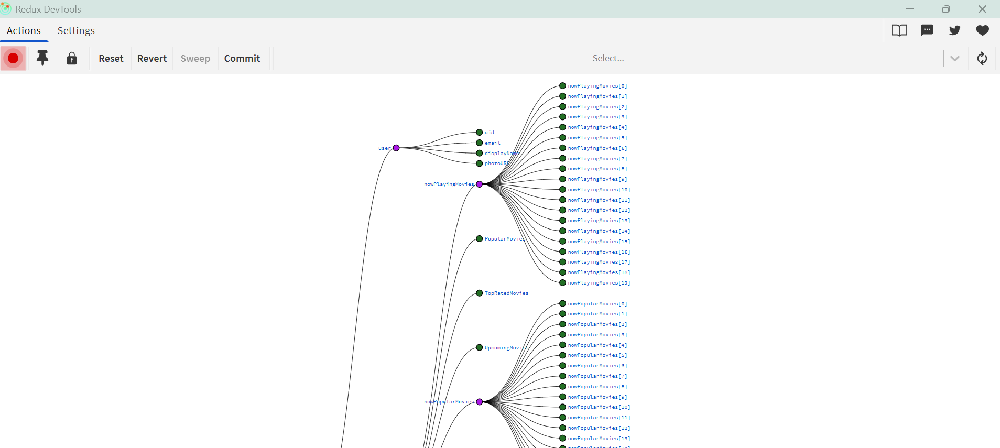
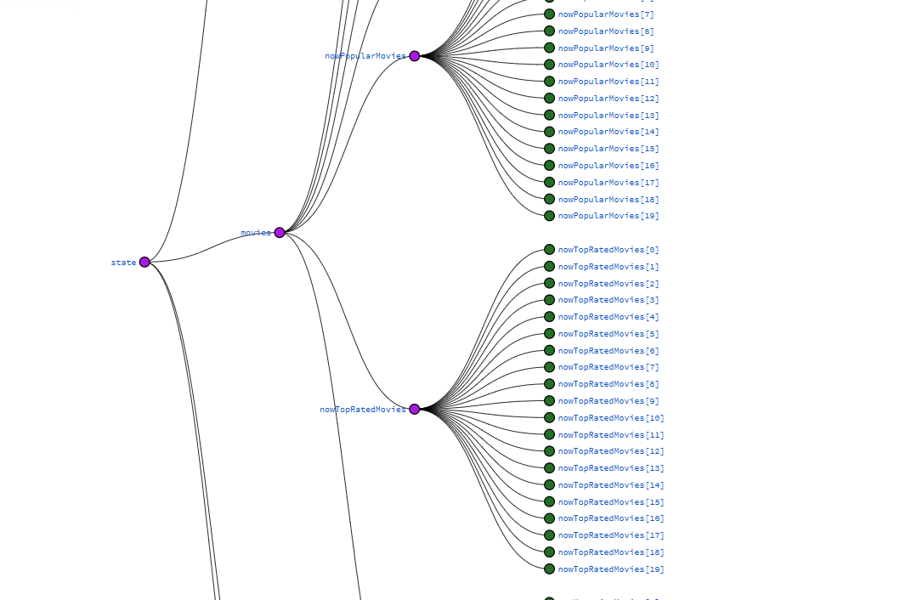
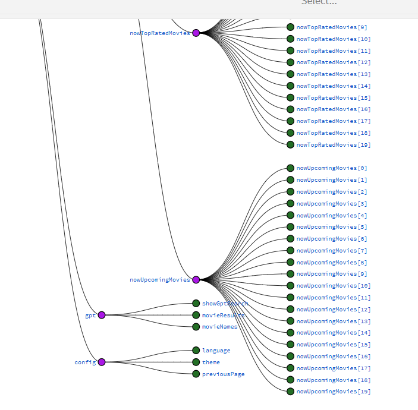

### 🧙 Hover Feature
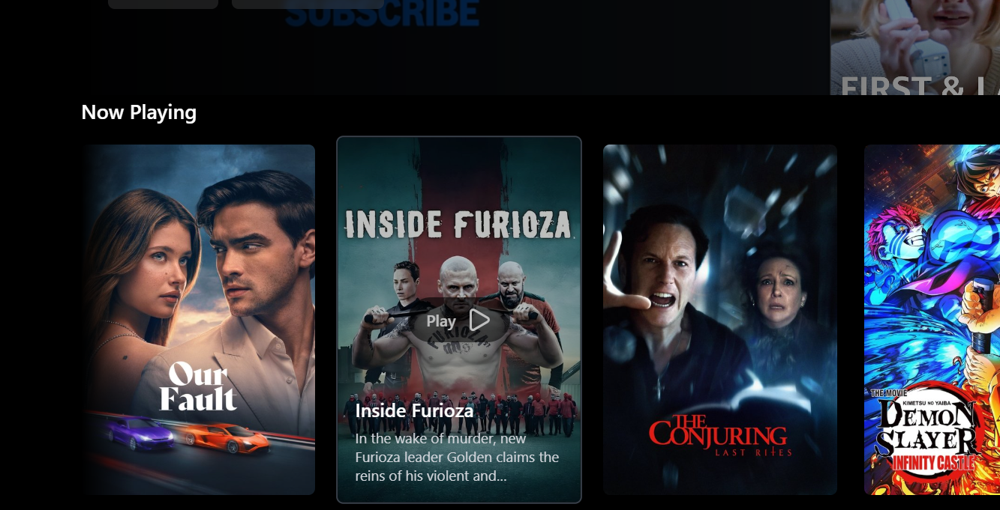
---

## 🧩 Tech Stack

| Frontend | Backend | APIs | State |
|----------|---------|------|-------|
| React    | Firebase Hosting & Auth | TMDB, OpenAI | Redux Toolkit |

---

## 🧠 Architecture & Design Highlights

- **Routing**: `react-router-dom` with dynamic paths (`/watch/:movieId`)
- **State Management**: Redux slices for user, movies, GPT, and config
- **Hooks**: Custom hooks for fetching movies, online status, GPT search
- **Components**: Modular structure with folders for GPT, login, shimmer, etc.
- **Session Storage**: Used to track navigation origin (browse vs GPT)
- **Responsive Design**: Tailwind breakpoints (`sm`, `md`, `lg`) used throughout
- **Offline Detection**: Custom hook + conditional rendering
- **Toast Feedback**: Triggered during GPT search
- **Shimmer UI**: For Browse and Watch pages
- **No Results UI**: When GPT returns empty suggestions
- **Memoization**: Prevents redundant API calls if Redux already has data
- **Environment Variables**: `.env` used for TMDB, OpenAI, Firebase keys

---

## 🛠️ Project Setup

```bash
# Clone the repo
git clone https://github.com/Aneesh-Khanna/netflix-gpt
cd netflix-gpt

# Install dependencies
npm install

# Create .env file
touch .env

```

🔐 .env Configuration

``` bash

REACT_APP_TMDB_API_KEY=your_tmdb_key
REACT_APP_OPENAI_KEY=your_openai_key
REACT_APP_FIREBASE_API_KEY=your_firebase_key

```

---

📚 Steps followed to build the project:

🔧 Initial Setup
- npx create-react-app netflix-gpt
- Clean boilerplate: remove test files, logo, default styles
- Configure Tailwind CSS
- Create GitHub repo and link project
- Create components/ and utils/ folders

🧱 Component Development
- Created Login, Header, Body, Browse components
- Setup routing with react-router-dom
- Used useRef for form handling
- Created validate.js for form validation logic

🔐 Firebase Integration
- Setup Firebase project and enabled authentication
- Installed Firebase SDK and created firebase.js
- Used createUserWithEmailAndPassword, signInWithEmailAndPassword, updateProfile
- Stored user data in Redux via userSlice
- Used onAuthStateChanged for persistent auth state

🧠 Redux Store
- Installed Redux Toolkit and React Redux
- Created slices: userSlice, movieSlice, gptSlice, configSlice
- Provided store to app

🎞️ TMDB API Integration
- Registered TMDB API and obtained access token
- Created custom hooks: useNowPlayingMovies, usePopularMovies, useTopRatedMovies, useUpcomingMovies
- Stored movie data in Redux
- Created MainContainer, SecondaryContainer, MovieList, MovieCard

📺 Watch Page
- Added dynamic routing /watch/:movieId
- Used useParams to fetch movie ID
- Created shimmer UI for Watch page
- Added back navigation logic using session storage

🔍 GPT Search
- Registered OpenAI and obtained API key
- Created openai.js config file
- Built GptSearchBar, GptSearch components
- Used useRef to capture input
- Called GPT API and parsed movie suggestions
- Fetched movie details from TMDB
- Stored results in gptSlice
- Added shimmer UI, toast notifications, and no-results 

🌐 Multi-language + Theme
- Created configSlice to manage language and theme
- Added language constants and dynamic selector
- Scoped theme and language to GPT page only

📄 Offline Page
- Created OfflinePage component
- Built custom hook useOnlineStatus
- Conditionally rendered offline page in App.js

🧼 Final Touches
- Memoized API calls to prevent redundant fetches
- Skipped rendering movie cards with missing posters
- Removed console logs from production
- Updated favicon and manifest
- Structured folders for scalability
- Rehosted on Firebase

📦 Deployment
Firebase Hosting
npm run build
firebase deploy

Keys are embedded during build. No need to set env variables on Firebase Hosting.

---

📁 Folder Structure

``` bash
src/
├── components/
│   ├── Browse.js
│   ├── CustomOfflinePage.js
│   ├── GptMovieSuggestions.js
│   ├── GptSearch.js
│   ├── GptSearchBar.js
│   ├── Header.js
│   ├── Login.js
│   ├── MainContainerBrowse.js
│   ├── MovieCard.js
│   ├── MovieDescription.js
│   ├── MovieHeading.js
│   ├── MovieList.js
│   ├── MovieMeta.js
│   ├── MovieTrailer.js
│   ├── NoResults.js
│   ├── PeopleGrid.js
│   ├── SecondaryContainerBrowse.js
│   ├── VideoBackground.js
│   ├── VideoTitle.js
│   └── Watch.js

├── customHooks/
│   ├── useGptMovieData.js
│   ├── useNowPlayingMovies.js
│   ├── useOnlineStatus.js
│   ├── usePopularMovies.js
│   ├── useTopRatedMovies.js
│   └── useUpcomingMovies.js

├── utils/
│   ├── firebase.js
│   ├── openAI.js
│   ├── validate.js
│   ├── constants.js
│   ├── languageConstants.js
│   ├── images/
│   │   └── bg-image.jpg
│   ├── ReduxStore/
│   │   ├── appStore.js
│   │   ├── configSlice.js
│   │   ├── gptSlice.js
│   │   ├── movieSlice.js
│   │   └── userSlice.js
│   ├── ShimmerUI_Browse/
│   │   ├── ShimmerBrowse.js
│   │   ├── ShimmerHeader.js
│   │   ├── ShimmerVideo.js
│   │   └── ShimmerRow.js
│   ├── ShimmerUI_GptPage/
│   │   └── ShimmerMovieRow.js
│   ├── ShimmerUI_Watch/
│   │   ├── ShimmerCast.js
│   │   ├── ShimmerDescription.js
│   │   ├── ShimmerMeta.js
│   │   ├── ShimmerTrailer.js
│   │   └── ShimmerHeading.js

├── App.js
├── index.js
├── index.css

```
---

🧙 UX Touches
- 🎭 Shimmer UI for Browse and Watch pages
- 🔙 Back to Browse / GPT based on origin
- 🌐 Language selector on GPT page only
- 🌙 Theme toggle on GPT page only
- 🧼 Skip rendering movie cards with missing posters
- 🔔 Toast notification while GPT search is loading
- ❌ No results UI when GPT returns empty

---

🧠 Best Practices Followed
- ✅ Secrets hidden via .env
- ✅ Modular architecture with reusable hooks
- ✅ Responsive design across breakpoints
- ✅ Clean routing and navigation logic
- ✅ Firebase CLI used for hosting
- ✅ Manifest and favicon updated
- ✅ robots.txt allows full indexing

---

📬 Contact
- Built by Aneesh Khanna
- Feel free to fork, star, or contribute!

---


